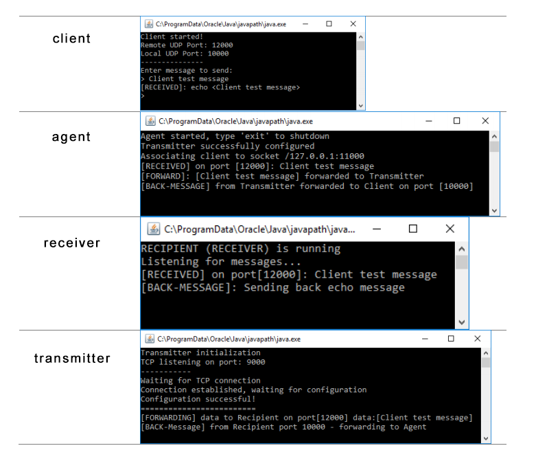

#UDP over TCP Tunnel
##Course
Computer Networks in Java
##Goal
Implement UDP over TCP Tunnel in Java program
##Documentation
File `dokumentacja.pdf` is a polish documentation of the program performed
##And compile samples
There added compile and example run scripts:
`compile.bat` - compiling bat file
`run_oneclient.bat` - runs a tunnel with one client of agent's side
`run_fewclients.bat` - runs a tunnel with three clients of agent's side
##Screenshot
